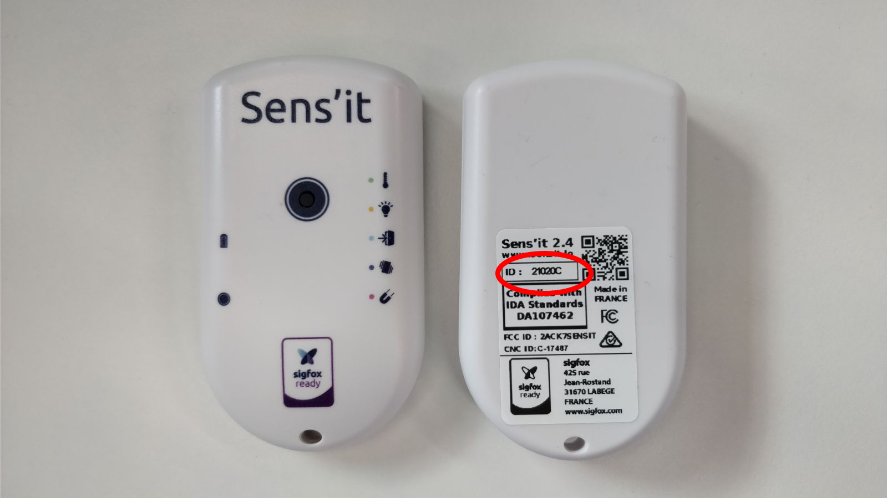
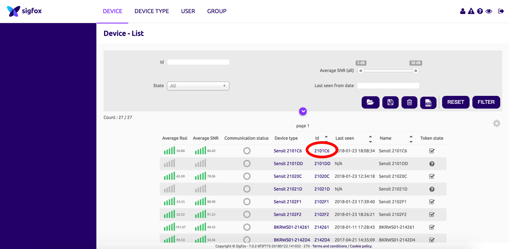

# Sensit workshop

How to add a Sensit on Sigfox Platform

## About this workshop

The goal of this workshop is to understand how to get started with Sigfox.
For this workshop, we will be using a Sensit (Sigfox device with various sensors).
More info on

The different steps will be:

* Send your first Sigfox message
* See your message in the Sigfox backend
* Deploy an open source platform.
* Set a callback to push your data to this platform.
* Parse a Sigfox payload.
* Understand Sigfox Geolocation service.

## Send you first Sigfox message

You've been provided a Sensit.

This is a Sigfox device that include multiple sensors:
- Temperature sensor
- Humidity sensor
- Light sensor
- Accelerometer
- Magnet (Hall effect)
- Button

In this workshop, we won't see how to reprogram this device using its SDK but feel free to have a look at [build.sigfox.com](https://build.sigfox.com/sensit-for-developers).

Let's start with sending a message: Just double press the button.
That's it!

## See your messages in Sigfox Backend



Now go to [Sigfox Backend](https://backend.sigfox.com) and login with the credentials you've been given.
Click on the device menu and select your device.


Now click on message, you should see your message:


Cool right?
Okay, but what can I do with this message?

The next step will be to deploy an open source platform to see and use this Sigfox messages.

## Sigfox Platform

### Deploy your own instance with [Heroku](https://heroku.com)

Deploy an instance on your Heroku account to play around with it!

[](https://heroku.com/deploy?template=https://github.com/luisomoreau/sigfox-platform/)


If you are not familiar with Heroku, just create an account and follow the procedure:

1. **Create a new app:**

Choose the name you want and the region does not really matter for this testing purpose.


Click then on deploy app.

2. **Build & deploy app:**


3. **Link the application with a MongoDB MLab database (Free):**

*Note that if you don't link a database to your application, all the data will be erased every time the application restarts.*

* Go to [https://mlab.com](https://mlab.com/login/) and create an account and login.

* Create a new MongoDB Deployments:


* Select your plan:


* Select your region:


* Create database:


* Validate:


* Create database user:


* Copy your MongoDB URI :


* Go back to your Heroku Dashboard and go to the Settings tab:


* Click on Reveal Config Vars and add your MongoDB URI (Don't forget to replace your username and password):


* Restart all dynos:


### User guide

- Click on the Open app button and register:


Note that, the first user to register will be granted an admin role.
The other users to register will be granted user roles.

When you logged in successfully, you will arrive on the overview page. At this stage, it should be empty:


Now we want to create a callback from the Sigfox Backend to push incoming messages to the platform:

Navigate to the Connectors tab and create a developer access token:


Now go back to the Sigfox Backend and click on the INFORMATION tab of your device:


Click on the CALLBACKS tab:


Create a new callback:


Fill the sigfox backend callback information using using the instructions from the Heroku app:


Submit

Use your device to send a Sigfox message again (double click on the buttonog device and view it on the platform:


Add another callback in the Sigfox backend to use the Sigfox geolocation service:


The Geolocation information may take up to 10 seconds to arrive. This is the necessary time for all the messages to be received by Sigfox Backend and to process the Geolocation service.

## Decode Sigfox Payload

**Let's focus on how to add your new parser in order to decode custom payloads.**

You must respect a particular nomenclature such as the payload variable name, the geolocation structure _(if any)_ and the result of the function you will write.

### 1. The payload variable name: `var payload`

This variable will automatically contain the Sigfox message hexadecimal frame used for your parsing, make sure to name it as above.

### 2. The result of the parser

This has to be an **array of objects**. Each object has to follow this structure:

* key
* value
* type
* unit

```javascript
var obj = {};
obj.key = ; //(string) a key
obj.value = ; //(any) a value
obj.type = ; //(string) a type (string, number, boolean)
obj.unit = ; //(string) a unit or none ('°C', '%', '')
```


### Example
```javascript
var payload,
  temperature,
  parsedData = [],
  obj = {};

// If byte #1 of the payload is temperature (hex to decimal)
temperature = parseInt(payload.slice(0, 2), 16);

// Store objects in parsedData array
obj = {};
obj.key = 'temperature';
obj.value = temperature;
obj.type = 'number';
obj.unit = '°C';
parsedData.push(obj);

//console.log(parsedData);
return parsedData;
```

Returns:

If the hexadecimal payload is '11'.
```javascript
[
  {
    "key": "temperature",
    "value": 17,
    "type": "number",
    "unit": "°C"
  }
]
```

## Your turn to code!

Now let's try to decode the Sensit payload.
Here you will find the payload description:
[Sensit payload description](screenshots/Sensit-Payload-Decoding-Guide.pdf)

To simplify the task, you will only need to decode the light, the temperature and humidity.
Here is the base parser:

Go back on the platform and add a parser to decode the Sigfox Payload:


Copy paste the following code into the new parser:
```
var payload,
    battery,
    type,
    timeFrame,
    mode,
    humidity,
    temperature,
    light,
    alert,
    firmwareVersion,
    parsedData = [],
    obj = {};

// Byte #1
var byte = parseInt(payload.slice(0, 2), 16).toString(2);
while (byte.length < 8)
    byte = '0' + byte;
battery = byte.slice(0, 1);
type = parseInt(byte.slice(1, 3), 2);
switch (type) {
    case 0:
        type = 'Classic';
        break;
    case 1:
        type = 'Button';
        break;
    case 2:
        type = 'Alert';
        break;
    case 3:
        type = 'New Mode';
        break;
    default:
        type = 'Unknown {' + type + '}';
}
timeFrame = parseInt(byte.slice(3, 5), 2);
switch (timeFrame) {
    case 0:
        timeFrame = '10 minutes';
        break;
    case 1:
        timeFrame = '1 hour';
        break;
    case 2:
        timeFrame = '6 days';
        break;
    case 3:
        timeFrame = '24 hours';
        break;
    default:
        timeFrame = 'Unknown {' + timeFrame + '}';
}
mode = parseInt(byte.slice(5, 8), 2);
switch (mode) {
    case 0:
        mode = 'Button';
        break;
    case 1:
        mode = 'Temperature & Humidity';
        break;
    case 2:
        mode = 'Light';
        break;
    case 3:
        mode = 'Door';
        break;
    case 4:
        mode = 'Move';
        break;
    case 5:
        mode = 'Reed switch';
        break;
    default:
        mode = 'Unknown mode {' + mode + '}';
}

// Byte #2
var byte = parseInt(payload.slice(2, 4), 16).toString(2);
while (byte.length < 8)
    byte = '0' + byte;
battery += byte.slice(4, 8);
battery = (parseInt(battery, 2) * 0.05 + 2.7).toFixed(2);

// Temperature & Humidity
if (mode === 'Temperature & Humidity') {
    // Byte #2
    var byte = parseInt(payload.slice(2, 4), 16).toString(2);
    while (byte.length < 8)
        byte = '0' + byte;
    temperature = byte.slice(0, 4);
    // Byte #3
    var byte = parseInt(payload.slice(4, 6), 16).toString(2);
    while (byte.length < 8)
        byte = '0' + byte;
    temperature += byte.slice(2, 8);
    temperature = ((parseInt(temperature, 2) - 200) / 8).toFixed(2);

    if (type !== 'Button')
    // Byte #4
        humidity = parseInt(payload.slice(6, 8), 16) * 0.5;
    else {
        // Byte #4
        var byte = parseInt(payload.slice(6, 8), 16).toString(2);
        while (byte.length < 8)
            byte = '0' + byte;
        firmwareVersion = parseInt(byte.slice(0, 3), 2) + '.' + parseInt(byte.slice(4, 8), 2);
    }
}

// Light
if (mode === 'Light') {
    // Byte #3
    var byte = parseInt(payload.slice(4, 6), 16).toString(2);
    while (byte.length < 8)
        byte = '0' + byte;
    var multiplier = parseInt(byte.slice(0, 2), 2) * 8;
    light = parseInt(byte.slice(2, 8), 2);
    light = multiplier * light * 0.01;
}

// Alert (Door - Move - Reed switch)
if (mode === 'Door' || mode === 'Move' || mode === 'Reed switch'){
// Hint: on Byte #4

  }


// Store objects in parsedData array
obj = {};
obj.key = 'type';
obj.value = type;
obj.type = 'string';
obj.unit = '';
parsedData.push(obj);
obj = {};
obj.key = 'timeFrame';
obj.value = timeFrame;
obj.type = 'string';
obj.unit = '';
parsedData.push(obj);
obj = {};
obj.key = 'mode';
obj.value = mode;
obj.type = 'string';
obj.unit = '';
parsedData.push(obj);
obj = {};
obj.key = 'firmwareVersion';
obj.value = firmwareVersion;
obj.type = 'string';
obj.unit = '';
parsedData.push(obj);
obj = {};
obj.key = 'temperature';
obj.value = temperature;
obj.type = 'number';
obj.unit = '°C';
parsedData.push(obj);
obj = {};
obj.key = 'humidity';
obj.value = humidity;
obj.type = 'number';
obj.unit = '%';
parsedData.push(obj);
obj = {};
obj.key = 'light';
obj.value = light;
obj.type = 'number';
obj.unit = 'lux';
parsedData.push(obj);
obj = {};
obj.key = 'alert';
obj.value = alert;
obj.type = 'boolean';
obj.unit = '';
parsedData.push(obj);
obj = {};
obj.key = 'battery';
obj.value = battery;
obj.type = 'number';
obj.unit = 'V';
parsedData.push(obj);

//console.log(parsedData);
return parsedData;
```

This code does not include the alerts.

Here are few things for you to understand if you want decode the alerts:

- The Sigfox payload is a string of hexadecimal characters:
```
var payload = "12345aefd"
```
To parse a string of characters in hexadecimal, you need to user the parseInt function. First parameter being your string and the second one being the base (16).

If the 4th byte is equal to zero then alert is to false else, it is true.

Add your custom piece of code in the following previous code.
Look for:

```
// Alert (Door - Move - Reed switch)
if (mode === 'Door' || mode === 'Move' || mode === 'Reed switch'){
// PUT YOUR CODE HERE

}  

```


Now go to Device and click on edit:


You now can see the decoded payload in the message view or in the overview:


And see the graphs:


## Additional content

* [Framboise314](http://www.framboise314.fr/carte-de-prototypage-sigfox-par-snoc/)

* [Tutos Instructables](www.instructables.com/member/luisomoreau/)

* [Tutos Hackster](https://www.hackster.io/luisomoreau)
